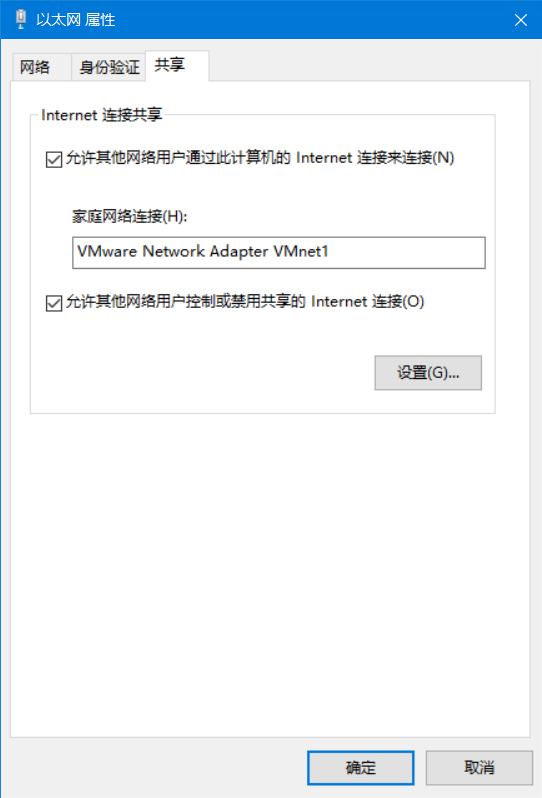
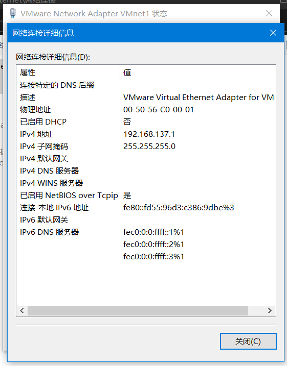
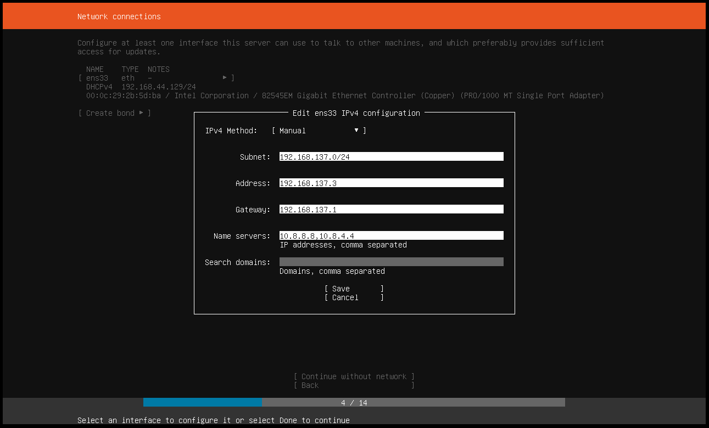
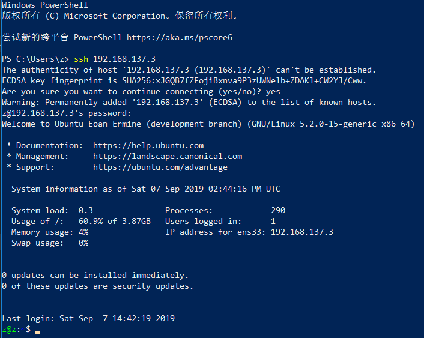

# 在个人电脑上搭建云桌面服务

17343116 吴国璋

## 环境

Windows 10 18362.10019

VMware Workstation 15 Pro

Ubuntu Server 19.04

## 实验过程和结果

安装虚拟机的具体过程不详述，主要需要关注网络配置问题。为了使主机能够方便地通过IP地址访问虚拟机，需要给虚拟机使用“仅主机网络”模式。并启用主机的网络共享。在此模式下，主机将作为虚拟机的默认网关，虚拟机需要访问外网时，经由主机访问外网。

在 Windows 10 上，启用网络共享时，相应的网络适配器的IP地址被固定为 192.168.137.1。具体步骤是：打开适配器选项，选择主机当前连接到互联网的网卡，进入属性，在“共享”中打开网络共享，并选择 VMware 的 VMnet1 网卡（该网卡用于 VMware 虚拟机中的“仅主机”网络）：

此时，主机的 VMnet1 适配器地址已被 Windows 10 设定为 192.168.137.1。

安装 Ubuntu Server 时，由于主机的 VMnet1 地址被改变，需要在虚拟机中手动配置 IPv4 地址。其中，虚拟机的IP地址可被配置为 192.168.137.0/24 中的任意一个（除主机外），默认网关配置为主机的IP地址，而 DNS 服务器则需要配置为与主机的配置一致。这样，当虚拟机需要使用 DNS 服务时，将经过主机访问虚拟机内配置的 DNS 服务器地址。如图所示：

顺利安装 Ubuntu Server 并升级到 Eoan Ermine (development branch) 版本之后，可在主机上通过ssh远程连接至虚拟机，如下图所示：

虚拟机的配置现在可以满足云服务的要求，现在可以通过 ssh 的方式来访问虚拟机了。